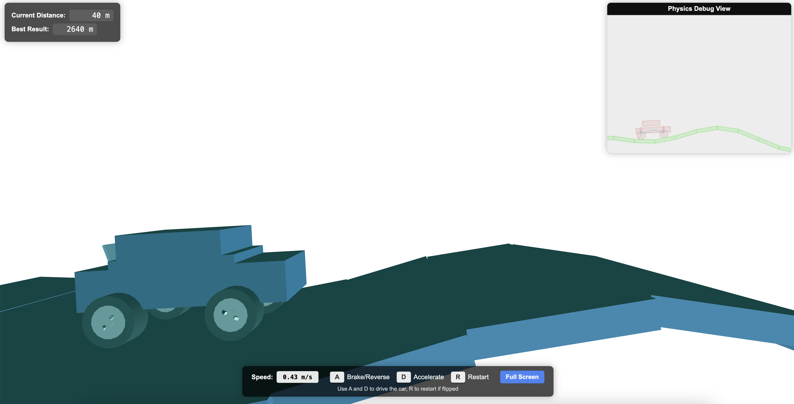

# HTML5 Gravity Car

A physics-based HTML5 car driving game where you can drive a car through procedurally generated hills.

## Features

- Physics-based car movement with realistic suspension
- Procedurally generated terrain
- Real-time physics visualization
- Responsive design that works on various screen sizes

## Technologies Used

- HTML5 Canvas
- WebGL (Three.js)
- Box2D Physics Engine
- RequireJS for module loading

## Local Development

To run the game locally:

1. Clone this repository
2. Open `index.html` in your browser

## Controls

- **A** - Brake/Reverse
- **D** - Accelerate
- **R** - Restart (if car is flipped)
- **Full Screen** button - Toggle fullscreen mode
